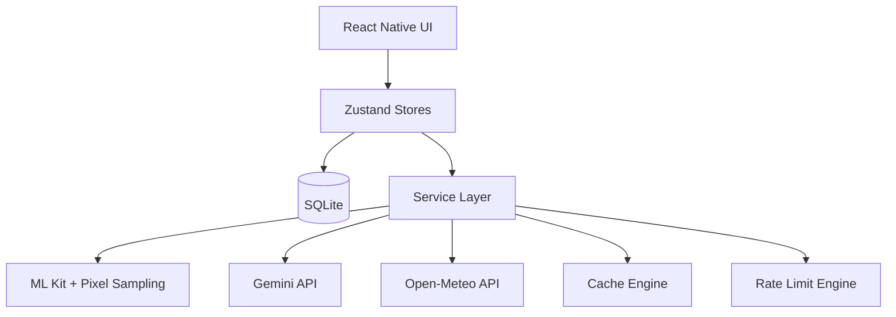
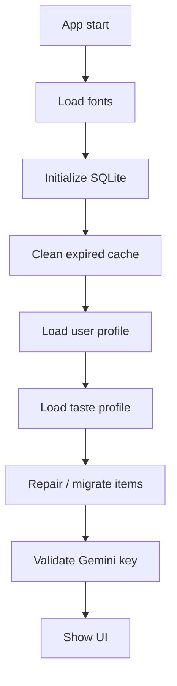
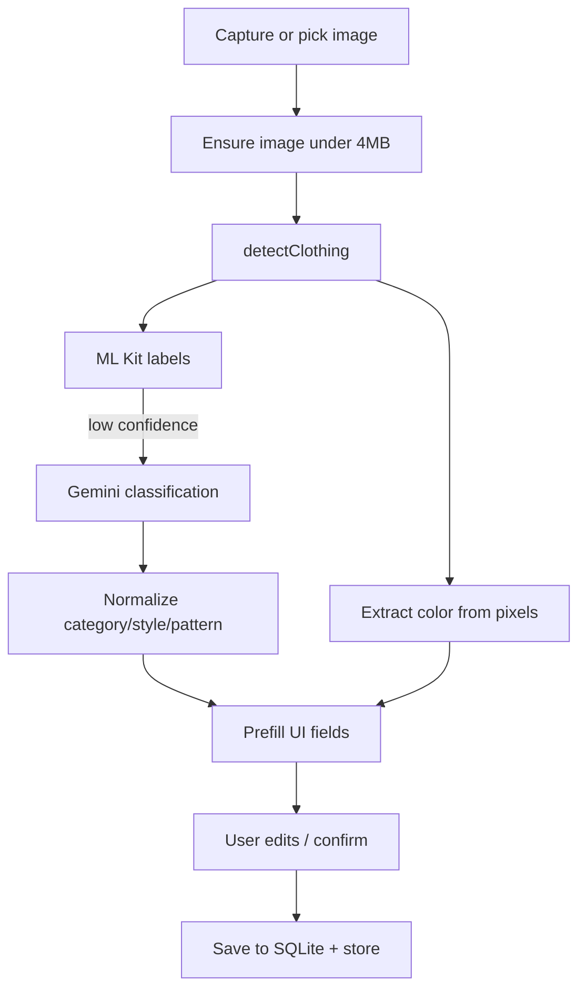
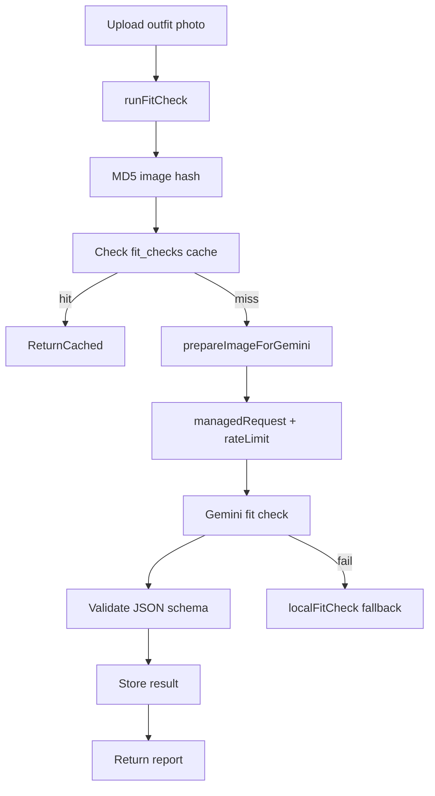
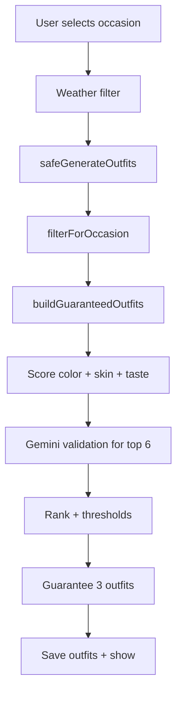
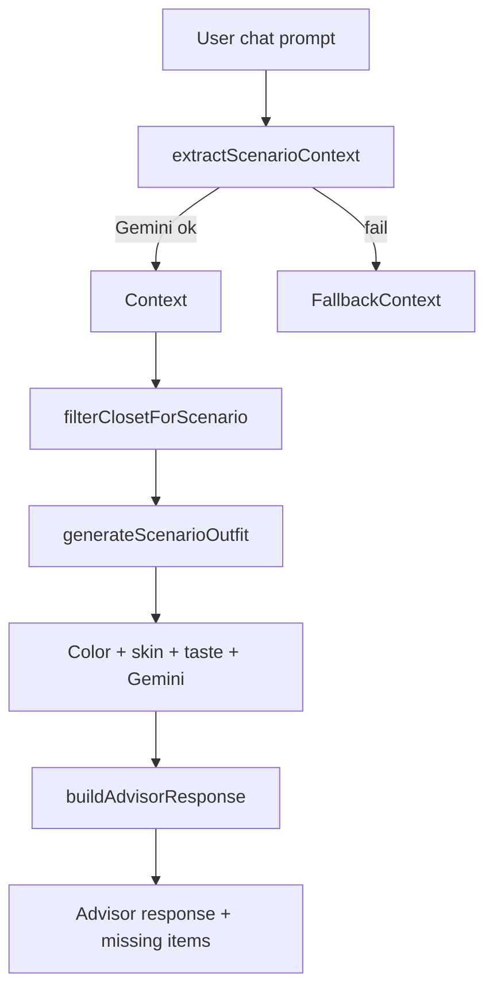
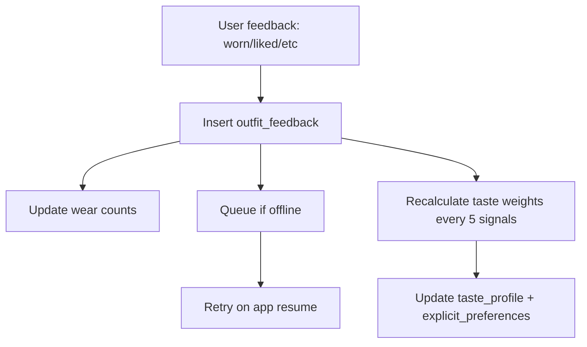

# FitMind Project Design Document

Date: 2026-05-20

## 1. Purpose
FitMind is a mobile-first styling assistant built with React Native (Expo). It runs primarily on-device with a local SQLite database and calls external AI services (Google Gemini) and a weather API. The system focuses on wardrobe management, outfit generation, fit checks, and scenario-based styling advice.

## 2. System Overview
- Platform: React Native + Expo
- Persistence: Local SQLite (expo-sqlite)
- State: Zustand stores
- AI: Gemini API for classification validation, outfit validation, fit check analysis, scenario extraction
- Local ML: ML Kit image labeling (native only)
- External data: Open-Meteo weather API

### 2.1 High-Level Architecture

## 3. Core Data Model (SQLite)
Key tables defined in schema:
- user_profile: user skin tone, undertone, onboarding state
- clothing_items: wardrobe items and AI metadata
- outfits: generated outfits and scores
- fit_checks: AI fit-check results per image hash
- taste_profile: learned personalization weights
- explicit_preferences: explicit user preferences
- outfit_feedback: feedback signals
- api_cache: multi-tier cache metadata
- request_log: request rate logging
- schema_version: migration tracking

Note: Gemini usage tracking uses an `api_usage` table in the AI layer (for daily quota checks).

## 4. Frontend Structure
### 4.1 Navigation
- Stack + Bottom Tabs in [src/navigation/AppNavigator.tsx](src/navigation/AppNavigator.tsx)
- Onboarding flow routes to main tabs
- Core tabs: Home, Style Advisor, Closet, Fit Check, History

### 4.2 State Stores
- [src/store/useUserStore.ts](src/store/useUserStore.ts): user profile + explicit preferences
- [src/store/useClosetStore.ts](src/store/useClosetStore.ts): wardrobe items
- [src/store/useOutfitStore.ts](src/store/useOutfitStore.ts): outfit generation results
- [src/store/useTasteStore.ts](src/store/useTasteStore.ts): taste profile (not shown above but used)

## 5. AI and Service Layer
### 5.1 Request Management and Rate Limiting
- [src/services/requestManager.ts](src/services/requestManager.ts): dedup inflight calls, cache usage, rate limit gate
- [src/services/rateLimit.ts](src/services/rateLimit.ts):
  - Per-minute limit: 12
  - Per-hour limit: 50
  - Per-day limit: 1400
  - Min interval: 4500 ms
  - Logs to request_log table

### 5.2 Caching
- [src/services/cacheEngine.ts](src/services/cacheEngine.ts):
  - Tier 1: memory Map
  - Tier 2: SQLite table api_cache
  - TTL varies by category (fit check, outfit validation, scenario, weather, etc.)

### 5.3 AI Providers
- Gemini models: `gemini-2.0-flash` with fallback candidates
- Usage gates:
  - Managed by requestManager + rateLimit
  - Daily usage tracked in gemini.ts

### 5.4 Local ML and Image Processing
- ML Kit image labeling (native only): [src/services/classificationEngine.ts](src/services/classificationEngine.ts)
- Pixel sampling for color: [src/services/visionEngine.ts](src/services/visionEngine.ts)

## 6. Key Workflows

### 6.1 App Bootstrap
Implementation in [App.tsx](App.tsx)

### 6.2 Add Item / Closet Ingestion
Implementation in [src/screens/AddItemScreen.tsx](src/screens/AddItemScreen.tsx)

Key functions:
- detectClothing: classificationEngine with ML Kit + Gemini fallback
- extractColorFromPixels: pixel sampling only, no AI call
- normalizeClothingItem: standardizes fields before saving

### 6.3 Fit Check Workflow
Implementation in [src/screens/FitCheckScreen.tsx](src/screens/FitCheckScreen.tsx) + [src/services/gemini.ts](src/services/gemini.ts)

Failure handling:
- Automatic retry and JSON repair
- Local fallback if quota/network errors

### 6.4 Outfit Generation (Home)
Implementation in [src/services/outfitEngine.ts](src/services/outfitEngine.ts) + [src/screens/HomeScreen.tsx](src/screens/HomeScreen.tsx)

Scoring layers:
- Layer 1: color harmony + style rules
- Layer 2: skin tone compatibility
- Layer 3: taste profile fit
- Layer 4: Gemini validation (optional)

Fallbacks:
- If AI validation fails, assigns safe default score
- If insufficient outfits, generates basic fallback combinations

### 6.5 Style Advisor (Scenario Engine)
Implementation in [src/services/scenarioEngine.ts](src/services/scenarioEngine.ts)

### 6.6 Feedback Loop
Implementation in [src/services/feedbackEngine.ts](src/services/feedbackEngine.ts)

## 7. Rate Limiting and Reliability
### 7.1 Request Manager
- Deduplicates inflight requests (same cache key)
- Uses cache before hitting network
- Enforces min interval and per-window limits

### 7.2 Rate Limit Engine
- Logs each request to `request_log`
- Enforces per-minute, per-hour, per-day caps
- Provides diagnostics for debugging

### 7.3 Fallback Strategy
- Primary Gemini call
- Retry with compressed request (where applicable)
- Local rule-based fallback (fit check, outfit generation)

## 8. External APIs
- Gemini API: AI reasoning and validation
- Open-Meteo: weather data used to filter wardrobe

## 9. Security and Keys
- Gemini key stored via SecureStore (device)
- App config also supports env key
- Key validation performed on startup

## 10. Function-Level Highlights
### 10.1 Classification
- classifyClothingItem: ML Kit first, Gemini fallback
- validateClassification: category + style normalization
- resolveCategory: safe mapping for unknown labels

### 10.2 Outfit Engine
- filterForOccasion: relaxes filters if too strict
- buildGuaranteedOutfits: always returns a base pool
- validateWithGemini: optional scoring for top candidates
- generateGuaranteed: ensures minimum of 3 results

### 10.3 Scenario Engine
- extractScenarioContext: Gemini + keyword fallback
- generateScenarioOutfit: multi-layer scoring
- buildAdvisorResponse: explanation + missing items

### 10.4 Fit Check
- runFitCheck: hash caching + AI validation
- analyzeFitCheck: managed request + fallback
- validateFitCheckResponse: strict schema enforcement

## 11. Flowcharts Summary
- Bootstrap: initialization and key validation
- Closet ingestion: ML + pixel pipeline
- Fit Check: AI + cache + fallback
- Outfit generation: multi-layer scoring + Gemini validation
- Advisor chat: scenario extraction + closet filtering
- Feedback: learning loop into taste profile

## 12. Notes and Assumptions
- This app is primarily offline-first, with AI features requiring connectivity.
- Some modules are disabled on web (SQLite, ML Kit).
- The Gemini daily usage tracking expects an `api_usage` table.
